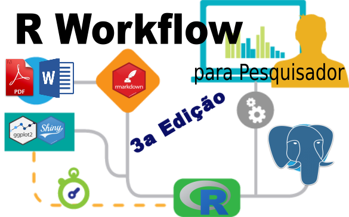

---
output:
  pdf_document: default
  html_document: default
---

```{r setup, include=FALSE}
knitr::opts_chunk$set(echo = TRUE)
```


# Quando: 19, 20, 22, 26 e 27 de Fevereiro de 2018

__Horário:__ das 14:00 às 18:00

__Local:__ FEA-RP, LEIA 1

A inscrição deve ser feita na Secretaria do Departamento de Economia - FEA/RP - Sala 34 Bloco A, de Segunda a Sexta das 9:00 às 18:00.
Documentos necessários:

  * Cópia do RG
  * Cópia do CPF
  * Certidão de Nascimento ou Casamento


# Conteúdo:

## Introdução ao R

### O que é?
### RStudio
### Variáveis
   * Texto
   * Número
   * Vetor / Matriz
   * Factor
   * Dataframe
  
## Obtenção de dados
### Abrindo arquivos
  * CSV
  * Excel
  
### Web scraping  
  * Baixando arquivos diretamente da web
  * Mineração de extração de dados do HTML
  * Extração a partir do formato JSON

## Armazenamento de dados
### SQL, porquê usar?
### PostgreSQL, apresentando
  * Conceitos (tabelas, schemas)

### Conectando com R
  * Criando tabelas a partir de Dataframes
  * Lendo tabelas para um Dataframe

### SQL 101
  * Selecionando tabelas
  * Selecionando variáveis
  * Criando variáveis calculadas
  * Filtrando resultados
  * Merge de tabelas
  * Funções de agregação (soma, média, máximo, mínimo, regressão linear, etc)
  * Funções para manipulação de dados (trim, unaccent, strtoupper, etc)
  * Técnica para padronização de nomes
  * Criando tabelas a partir de consultas
  
## Trabalho colaborativo/Versionamento (Git)


## Análise de dados
  * Produzindo estatísticas descritivas
  * Regressão (MQO e Logit)
  * Clusterização

## Gráficos
  * Pacote ggplot2
  * Plotando mapas com leaflet
  
## Geração de relatório com RMarkdown
  * Capítulos e seções
  * Formatação de texto
  * Tabelas
  * Imagens
  * Inserindo comandos de R
  * Plotando gráficos

## Geração de páginas com Shiny
  * O que é o Shiny
  * Criando uma página com Shiny
  * Criando um mapa interativo
  
