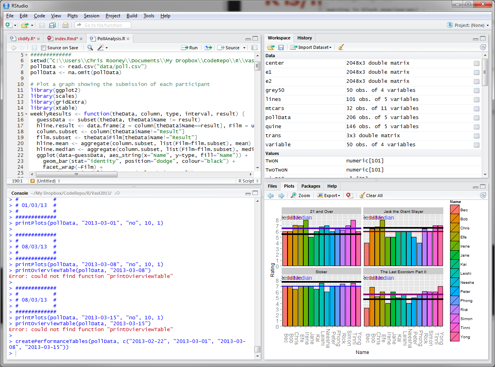

```{r setup, include=FALSE}
knitr::opts_chunk$set(echo = T)
knitr::opts_chunk$set(cache = T)
knitr::opts_chunk$set(fig.align = 'center')
# lapply(c('jsonlite','RPostgreSQL','ggplot2'),function(pacote){
#       install.packages(pacote)
# })


library(jsonlite)
library(RPostgreSQL)
library(ggplot2)

con2 <<- dbConnect(PostgreSQL(), user= "usr_usp", password='leitura',  dbname="bases",host="nv1.fearp.usp.br",port='1754')


```

## Introdução ao R - aula 1{.build}

### Material de apoio 
  * [Google drive](https://goo.gl/QLdDbo)

### O que é? 
  * O R é uma linguagem de programação voltada à manipulação de dados  
  * Possui ferramentas para gerenciamento de dados e cálculos estatísticos
  * Pesquisa reproduzível - [Livro](https://englianhu.files.wordpress.com/2016/01/reproducible-research-with-r-and-studio-2nd-edition.pdf)
  * Integração com outras ferramentas como o Sweave, KnitR (LaTeX) e Markdown
  * Possui vários pacotes estatísticos e para exibição de gráficos
  
## RStudio
- O RStudio é uma interface para R, que facilita e organiza nosso trabalho
- O RStudio está disponibilizado em https://www.rstudio.com/




## RStudio
- Interface
- Help
- 1+1 -> Usando o console
- A importância de se criar Projetos
- Criando arquivo de script .R

## Variáveis
   * Texto
   * Número
   * Vetor / Matriz
   * Factor
   * Dataframe
   
## Texto
- As variáveis textuais em R são sempre cercadas por aspas simples ' ou duplas "
```{r, echo=T}
  sIdade <- "31" 
  sPen <- 'Pen'
  sApple <- 'Apple'
  sPineapple <- 'Pineapple'
```
> As variáveis textuais também são conhecidas como variáveis character ou strings

## Variáveis Texto - Operações
- Concatenação
```{r}
  paste(sApple,sPen)
  paste0(sPineapple,sPen) 
  paste(sPen,sPineapple,sApple,sPen,sep='|')
```


## Variáveis
- Listando variáveis existentes
```{r}
  ls()
```

- Apagando variável
```{r}
  rm(sIdade)
  ls()
```

```{r, eval= FALSE}
  rm(list=ls())
```

## Variáveis Numéricas - Criação
- As variáveis numéricas são criadas atribuindo um valor numérico a uma variável (Não diga!!!)
```{r}
  nIdade <- 25
```
- Operações
```{r}
  nIdade + 9
  nIdade - 5
```

> Qual o valor da variável nIdade?


## Variáveis Numéricas - Operações
- Operações
```{r, eval=F}
  nIdade * 3       #multiplicação
  nIdade / 5       #divisão
  nIdade ^ 2       #potenciação
  sqrt(nIdade)     #radiciação 
  log(10,base=10)  #logaritmo
  log10(10)        #logaritmo
  exp(1)           #exponenciação
  sin(0.5*pi)      #seno 
  cos(2*pi)        #cosseno
  tan(pi)          #tangente
  (3 + 3)*0 + 3    #precedência de operador
  3 + 3*0 + 3
```


## Variáveis Lógicas - Criação
- As variáveis lógicas em R são TRUE e FALSE
```{r}
  TRUE == T
  TRUE == 'true'
  FALSE == F
```

## Vetores - Criação
- Os vetores são um tipo de variável em R que armazena uma coleção de elementos de uma mesma classe
```{r}
  v1 <- 1:10
  v1
  v1 <- seq(from=0, to=1, length = 9)
  v2 <- seq(from=0, to=0.5, length = 9)
  v2
```

## Vetores - Criação
```{r}
  v1/v2 
```
- O que é o NaN?
```{r}
rep( c(1,2), each=3 )
c(1,2,3,4,"a")
```


## Vetores - Gerando dados
```{r}
  A1 <- c(1,2,3);
  A2 <- c(10,20,30)
  v3 <- c(A2,A1) 
  v3
  sort(v3)
```
- Obs: Qual o valor de v3?

## Vetores
- Acessando posições dos vetores
```{r}
  v3[1]
  v3[1:4]
  v3[4:1]
```

## Vetores
- Acessando posições dos vetores
```{r}
  v3[length(v3):1]
  v3[1] <- 5
  v3
  v3 <- c(v3,40)
  v3
```

## Vetores
- Acessando posições dos vetores
```{r}
  v3[-5]
  v3[-c(2,4)]
```

## Vetores
- Buscando elementos em vetores
```{r}
  v3[v3 > 20]
  v3[v3 < 20]
  v3[v3 == 4]
```

## Vetores
- Operações com vetores
```{r,eval=F}
  sum(v3)
  mean(v3)
  max(v3)
  var(v3)
  sd(v3)
  log(v3)
```

## Operação com vetores{.small}

```{r}
  v3*v3
  v3*3
  v3+4
  v3%*%v3
```


## Matriz
- A matriz pode ser criada com a função matrix(), um vetor e definindo o número de linhas e colunas
```{r}
  m <- matrix(data=1:12,nrow=3,ncol=4); m
  m <- matrix(data=1:12,nrow=3,ncol=4,byrow = T);  m 
```

## Matrizes
- Acessando posições das matrizes
```{r}
  m[1,1]
  m[1,]
  m[2:3,2]
```

## Operações com matrizes 
-Criação de matriz linha a linha
```{r}
  cLinha1 <- c(1,2)
  cLinha2 <- c(3,-2)
  m <- rbind(cLinha1,cLinha2)
  m
  m+2
```

## Operações com matrizes 
-Criação de matriz coluna a coluna
```{r}
  cCol1 <- c(1,2)
  cCol2 <- c(3,-2)
  m <- cbind(cCol1,cCol2)
  m
```


## Matrizes
- Operações com matrizes
```{r}
  sum(m)
  sum(m[1,])
  mean(m)
```

## Matrizes
- Operações com matrizes
```{r}
  nrow(m)
  ncol(m)
  dim(m)
```

## Matrizes
- Operações com matrizes
```{r}
  t(m) #transposta
  det(m) #determinante
```

## Matrizes
- Operações com matrizes
```{r}
  m%*%m #multiplicação matricial a
  #solve a%*%x=b
  solve(m,c(4,4))
```

## Matrizes
- Como calculo o inverso se uma matriz?
- Lembrem-se: X*X^-1 =I
- Se omitirmos o parâmetro b na função solve, ele usa a matriz identidade, por padrão
```{r}
  solve(m)
```
- O que acontece se eu rodar (```solve(t(m)%*%m)%*%t(m)%*%y```)?

## Matrizes - Solve
```{r}
solve(t(m)%*%m)%*%t(m)%*%c(4,4)
```

$\widehat{\beta}=(X'X)^{-1} X'Y$

## Fatores
- Tipo de dados para armazenar variáveis categóricas ou enumerada
- Por exemplo, a pesquisa de Avaliação Discente
```{r}
aRespostas <- c(1,4,2,4,3,4,1,2,1,3,4,4,3,4)
summary(aRespostas)
```

## Fatores
- Não seria melhor transformarmos em variável categórica?
```{r}
fRespostas <- factor(aRespostas)
summary(fRespostas)
```
- O que significam os valores 1, 2, 3 e 4?

## Fatores
- Níveis/Categorias
```{r}
levels(fRespostas)
```

## Fatores
- Podemos "etiquetar" esses níveis, de modo que facilitem a identificação
```{r}
fRespostas <- factor(aRespostas,labels=c('Dis. Comp.','Discordo','Concordo','Conc. Comp.'))
summary(fRespostas)
```

## Data frame
- Um data frame é usado para armazenarmos tabelas de dados
- Podemos fazer uma associação com uma planilha do Excel
- Um data frame pode conter diversos tipos de dados em suas colunas
```{r}
n = c(2, 3, 5) 
s = c("aa", "bb", "cc") 
b = c(TRUE, FALSE, TRUE) 
df = data.frame(n, s, b)       # df é um dataframe
```

> Clique na variável df que aparece na aba Environment

> Vamos ver como trabalhar com data frames, na prática

# Obtenção de dados

## Abrindo arquivos 
- O R tem capacidade de abrir a grande maioria dos arquivos de dados (incluindo .dta do Stata)
- Tipos de arquivos mais comuns
  - .dta
  - arquivo de colunas fixas
  - Excel
  - separado por vírgula (.csv)
  - outros: arquivo de dados e dicionário de dados
  
## Excel e CSV
- Transformando o Excel em csv
- Lendo o csv em um Data Frame
  
```{r, warning=F}
library('gdata')
dCidades <- read.csv('bases/cidades.csv',header=T,sep=',',quote='"')
```

> O R vai armazenar os dados com uma observação por linha e uma variável por coluna

## Web scraping
  - A técnica de Web scraping consiste em extrair dados diretamente de páginas ou serviços online
  - Vamos ver 3 técnicas diferentes para obter os dados
  - Alguns sites exigirão muito mais trabalho de codificação ou até mesmo a utilização de outras ferramentas (Selenium - Python)

## Baixando arquivos diretamente da web
  - Vamos utilizar o site do Ibge Cidades para obter alguns dados
  - Acessem o link [http://cidades.ibge.gov.br/xtras/home.php](http://cidades.ibge.gov.br/xtras/home.php)
  - Vamos analisar a estrutura desse site
    * Ao abrir uma cidade o link fica: [http://cidades.ibge.gov.br/xtras/perfil.php?lang=&codmun=350150&search=sao-paulo|alvinlandia](http://cidades.ibge.gov.br/xtras/perfil.php?lang=&codmun=350150&search=sao-paulo|alvinlandia)
    * O que acontece se trocarmos o codmun por 11001?
    [http://cidades.ibge.gov.br/xtras/perfil.php?lang=&codmun=110001](http://cidades.ibge.gov.br/xtras/perfil.php?lang=&codmun=110001)
    
  - Método GET e método POST
  - Explorando os Resultados da Amostra do Censo Demográfico 2010
  
## Entendendo o script ibge_cidades.R
  - Vamos abrir o arquivo ibge_cidades.R
    * Pacotes utilizados
    * Criação do data frame
    * Função FOR/Loops
    * Filtro em data frame
    * Conexão com o banco de dados
    * Gravando data frames em tabelas
    
## Exibindo o banco de dados
  - [EMS SQL Manager Free](http://www.sqlmanager.net/en/tools/free)
  - Usuário: r_workflow
  - Senha: curso
  - Acessando sua 'pasta'
  - Visualizando os dados
  - Outras interfaces:
    * [PgAdmin](https://www.pgadmin.org/)
    * PhpPgAdmin

## Mineração de extração de dados do HTML
  - Outra abordagem para extrair dados de páginas
  - Os dados ESTÃO na página
  - Quem cria a página são scripts, então temos que 'entrar na mente' do script para entender como pegar alguns dados
  - Abordagem em 2 etapas
    * Obter o campo chave
    * Processar as páginas com o campo chave
  - Vamos abrir o arquivo portaldosshoppings.R

## Entendendo o script portaldosshoppings.R
  * Pacotes utilizados
  * Abrindo a página [http://www.portaldoshopping.com.br/guia-de-shoppings](http://www.portaldoshopping.com.br/guia-de-shoppings)
  * Buscando padrões com a função __Inspecionar__ do browser
  * Obtendo todos os códigos dos shoppings
    - Um vislumbre sobre expressão regular (PADRÃO É TUDO)
  * Obtendo os dados a partir do HTML
  * Criando colunas para latitude (lat) e longitude (lng)
    

## O que é o formato JSON? {.smaller}

  - Um exemplo vale mais que 1000 palavras
```{r}
  prettify(toJSON(fromJSON('https://jsonplaceholder.typicode.com/posts/1')))
```

## Extração a partir do formato JSON
  - Muitos serviços WEB utilizam o formato JSON para retornar os dados
  - É um dos formatos mais fáceis de se trabalhar, mas pode ser um pouco difícil de encontrar o retorno
  - Muito comum em páginas que plotam mapas e gráficos
  - Vamos abrir o arquivo importa_lat_lng.R
  
## Entendendo o arquivo importa_lat_lng.R
  - Retornando tabelas do banco de dados com consulta
  - Usando a API geocode do google (limites diários)
    * Analisando o retorno: [https://maps.google.com/maps/api/geocode/json?sensor=false&address=Ribeirão%20Preto](https://maps.google.com/maps/api/geocode/json?sensor=false&address=Ribeirão%20Preto)
  - Retornando dados de um JSON
  - Atualizando um registro na tabela
  
# Armazenamento de dados - Aula 2

## SQL, porquê usar?
  - Qual programa vocês estão acostumados a utilizar para armazenar dados?
  
  > - 100 registros? (46Kb - 5% de 1 disquete de 3'')
  > - 10.000 registros? (42Mb - 42 disquetes ou 7% de 1 CD)
  > - 1.000.000 registros? (418Mb - 70% de 1 CD)
  > - 100.000.000 registros? (35GB - 9 DVDS!)
  
```{r, include=FALSE, cache=T}  
sSql <- paste0("
              select count(*) as qtd from (
               select distinct schemaname from pg_tables
              ) as t1
               ");
res <- dbSendQuery(con2, sSql)
dSchemas <- fetch(res,n=-1)

sSql <- paste0("
              select count(*) as qtd  from pg_tables
               ");
res <- dbSendQuery(con2, sSql)
dTabelas <- fetch(res,n=-1)


```
  > - Qual a memória esperada de um computador para processar e armazenar 2.2TB de bases de dados?
  
  > - A FEA-RP possui um computador com 2.2TB de bases abertas 
  > - Cerca de `r dSchemas$qtd` bases, com um total de `r dTabelas$qtd` tabelas abertas (disponíveis ao público em [cinfo.fearp.usp.br](cinfo.fearp.usp.br))
  
## Economia: produzir o máximo de bens e serviçosa partir dos recursos escassos disponíveis
  - Todas essas bases estão armazenadas em um computador com 16Gb de RAM e 8 processadores
  
    * Configuração que conseguimos ter hoje até mesmo em computadores domésticos
  
  - E a velocidade do processamento? Processamento de um arquivo com 500.000 linhas:
  
    > - Abertura com R: 1.11 min (tem que fazer toda vez que abrir o script)
    > - Abertura com SQL (copy): 36 secs (feito uma única vez)
    > - Busca de uma informação com R: 0.29 secs
    > - Busca de uma informação com SQL: 0.142 secs
    > - Busca de uma informação com SQL indexado: __0.017__ secs
  
  
## PostgreSQL, apresentando
  - Convencidos que temos algum ganho em utilizar a ferramenta certa?
  - Para nossos trabalhos utilizaremos um SGBD (Sistema Gerenciador de Banco de Dados) chamado PostgreSQL
    * Os conceitos aqui aprendidos podem ser utilizados com qualquer SGBD
  - Considerado o banco de dados Open Source mais avançado
  - Rivaliza com bancos pagos como ORACLE em termos de flexibilidade e performance

## PostgreSQL, conceitos
  - Todos os registros (ou observações) são armazenadas em objetos denominados __tabelas__
  - As tabelas são compostas de linhas (__observações__) e colunas (__variáveis__)
  - Cada variável só pode conter um único tipo de dado 
  - Todas as observações devem possuir o mesmo número de variáveis
    * OBS: NoSQL
  - Toda tabela pode ser organizada em __schemas__, como se fossem pastas com tabelas que correspondam a um determinado assunto. Ex: schema pessoa, armazenaria as tabelas que têm os dados sobre pessoas
  - O schema padrão é o __public__
  - No nosso curso, cada aluno tem um schema próprio no banco de testes (sNroUSP)
  
## Conectando com R
  - Criando tabelas a partir de Dataframes
    * Já vimos no exemplo do ibge_cidades
    
  - Lendo tabelas para um Dataframe  
    * Já vimos no exemplo do shopping
```{r, eval=F}    
sNroUSP = 's3672792'
library(RPostgreSQL)
dCidades <- read.csv('bases/cidades.csv',header = T,sep = ',', quote = '"',stringsAsFactors = F)
conCurso <<- dbConnect(PostgreSQL(), user= "r_workflow", password="curso"  
                       ,dbname="r_workflow",host="143.107.205.218",port='5432')
dbWriteTable(conCurso,c(sNroUSP,'cidades'),dCidades)
rm(dCidades)
dCidades <- dbReadTable(conCurso,c(sNroUSP,'cidades'))
```

# SQL 101

## Quando utilizar o SQL e o R?
  - Para os exemplos com SQL vamos utilizar o  SQL Manager
  - A idéia é transformarmos e tratarmos nossos dados no SQL até terem o formato de uma tabela simples
  - Com a tabela 'pronta' importamos para o R e lidamos com a parte estatística e econométrica
  - Vamos utilizar cada ferramenta para seu propósito

## Mudança de paradigma
   * Ao trabalharmos com SQL precisamos parar de pensar de forma sequencial 
   * Temos que começar a pensar de forma matricial (algebra relacional é uma área de pesquisa em computação)
   * Temos que entender que as operações não são feitas sobre uma única observação e sim sobre o conjunto completo delas
   * Por isso, precisamos ter um formato de output bem estruturado
     + Mesmas variáveis
     + Tipos de dados bem definidos
  
## Mudança de paradigma
  
  * De forma sequencial pensamos:
     + retorne A
     + retorne B
     + retorne A+B
  * De forma matricial temos que pensar:
     + Retorne A, B, A+B
     + Todo o processamento é feito 'em uma etapa'
  *  Reflitam: Ao lidarmos com milhões de registros, é melhor:
     + Aplicar as alterações um registro por vez?
     + Aplicar as alterações sobre todos os registros que couberem na memória, de cada vez?
    


## Selecionando tabelas
  - Anatomia SELECT
```{r, eval=F}
select * from s3672792.cidades as c limit 100
```

  - select *: selecione todas as variáveis
  - __from__  s3672792.cidades: da tabela cidades (com seus respectivo schema)
  - __as__ c: damos um 'apelido' para a tabela (facilita a digitação e identificação dos campos)
  - __limit__ 100: trazemos apenas 100 registros (uma amostra)
  
## Selecionando variáveis
  - E quando não queremos todas as variáveis?
  - No R/Stata teríamos que ler novamente a fonte de dados, caso tenhamos excluído uma variável necessária
  
  > - Com SQL, basta nomear as variáveis que queremos, separadas por vírgulas (ao invés de usarmos o *)
```{r, eval=F}
select codmun from s3672792.cidades as c limit 100
select nome from s3672792.cidades as c limit 100
select codmun, nome from s3672792.cidades as c limit 100
```

## Criando variáveis calculadas
  - E como podemos criar uma variável?
  - Mais uma vez, basta declarar, separada por vírgula
```{r, eval=F}
select codmun, 1 as dummy from s3672792.cidades as c limit 100
```
  - Podemos inclusive fazer operações entre o __select__ e o __from__
  - Vamos calcular o nome do Estado (texto após a barra "/" no nome)
```{r, eval=F}
select codmun,nome
	,strpos(nome,'/') as pos_barra
	,substr(nome, strpos(nome,'/')+1) as estado
from s3672792.cidades as c limit 100
```
  > - Mais adiante, vamos ver como criar essa coluna permanentemente no banco de dados
  
## Criando variáveis calculadas

  - Outro exemplo comum é precisarmos de uma variável dummy, baseada no valor de outra variável

  > - Vamos criar uma variável cujo valor será 1 se o nome da cidade contiver a letra R, 0 caso contrário
  > - E outra que valerá 1 se o código do município for par, 0 caso contrário

```{r, eval=F}
select codmun,nome
	,case when nome ilike '%R%' then 1 else 0 end as tem_r
	,case when substr(nome,1,strpos(nome,'/')) ilike '%R%' then 1 else 0 end as tem_r_1
    ,case when codmun%2 = 0 then 1 else 0 end as eh_par
 from s3672792.cidades as c limit 100
```

## Filtrando resultados
  
  -  Para filtrarmos os dados em SQL utilizamos a cláusula *where* após as declarações das tabelas
  
 > - Basicamente encadeamos todos os filtros com os comandos *and* e *or*
 > - Por exemplo: Quero filtrar apenas a cidade de Ribeirão Preto
 
```{r, eval=F}
select codmun,nome
	,substr(nome, strpos(nome,'/')+1) as estado
from s3672792.cidades as c where nome ilike 'Rib%Preto' limit 100
``` 

## Merge de tabelas
  - Como podemos descobrir as cidades que possuem mais que 10 estabelecimentos do SUS?
    * A informação com o número de estabelecimentos do SUS está na tabela sintese_informacao
    * O nome da cidade está na tabela cidades
    * Como juntar essas informações?
  - Os tipos de junções (joins) mais comuns que usaremos:
    * inner join: quando não há correspondência, exclui a observação
    * left outer join: quando não há correspondência, torna nula as variáveis não encontradas
  - Problemas com tipo de dados: '1'::integer é 1 e '-'::integer é o que?

## Merge e tabelas - analisando

```{r, eval=F}
select 
	c.codmun,c.nome,s.descricao,s.valor::integer
from s3672792.cidades c
left outer join s3672792.sintese_informacao s on (c.codmun = s.codmun)
where 
descricao = 'Estabelecimentos de Saúde SUS'
and 
case when valor = '-' then null else valor::integer end > 10
```   


